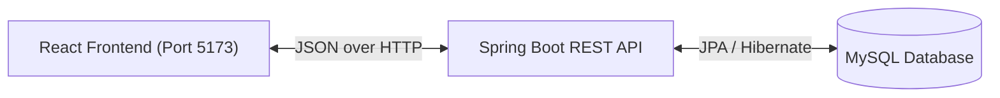

# 🏢 TASK-1: Employee CRUD Application


[](https://intern-spark-internship.vercel.app/)
[](https://employee-api-fqt8.onrender.com/api/employees)

## 📖 Project Overview
The **Employee CRUD Application** is a professional, full-stack web application designed to manage a company's workforce directory. It allows administrators to seamlessly Create, Read, Update, and Delete employee records through a highly responsive, visually stunning Glassmorphism interface.

## ✨ Features
- **Create Employees:** Add new team members with dynamic form validation.
- **View Directory:** Display a beautiful grid of employee cards with auto-generated avatars.
- **Update Records:** Edit existing employee details via an interactive React portal modal.
- **Delete Records:** Securely remove employees from the database.
- **Error Handling:** Graceful UI fallbacks and secure backend exception masking (e.g., duplicate email prevention).

## 🏗️ System Architecture



## 🛠️ Technology Stack
- **Frontend:** React, Vite, Lucide Icons, Pure CSS (Glassmorphism)
- **Backend:** Java 21, Spring Boot 4.1.0, Spring Data JPA, Hibernate
- **Database:** MySQL 9.x

## 📂 Folder Structure
```text
TASK-1/
├── backend/            # Spring Boot Server
├── frontend/           # React Client Application
├── LICENSE             # Project License
└── README.md           # This documentation
```

## 🚀 Installation & Running

### 1. Database Setup
Ensure MySQL is running and create the database:
```sql
CREATE DATABASE employee_db;
```

### 2. Running the Backend
Navigate to the `backend` folder and run the Spring Boot application:
```bash
cd backend
./mvnw clean spring-boot:run
```
*The backend will start on `http://localhost:8080`.*

### 3. Running the Frontend
Navigate to the `frontend` folder, install dependencies, and start the development server:
```bash
cd frontend
npm install
npm run dev
```
*The frontend will start on `http://localhost:5173`.*

## 🔌 API Integration Details
The frontend communicates with the backend via a dedicated `api.js` service, utilizing the `fetch` API. The backend handles CORS requests exclusively from `localhost:5173` ensuring secure data transmission.

| Endpoint | Method | Description |
|---|---|---|
| `/api/employees` | `GET` | Fetch all employees |
| `/api/employees` | `POST` | Create a new employee |
| `/api/employees/{id}` | `PUT` | Update an employee |
| `/api/employees/{id}` | `DELETE` | Delete an employee |

## 🔮 Future Improvements
- Implement JWT Authentication and Role-Based Access Control (RBAC).
- Add pagination and search filtering for large employee datasets.
- Implement unit and integration testing via JUnit and Jest.

## 🎓 Learning Outcomes
- Developed a deep understanding of standard REST API design.
- Learned how to prevent server stack trace leakage via `@ControllerAdvice`.
- Mastered React functional components, hooks (`useState`, `useEffect`), and portals.

---
**Author:** VAJJHA SAI KRISHNA
