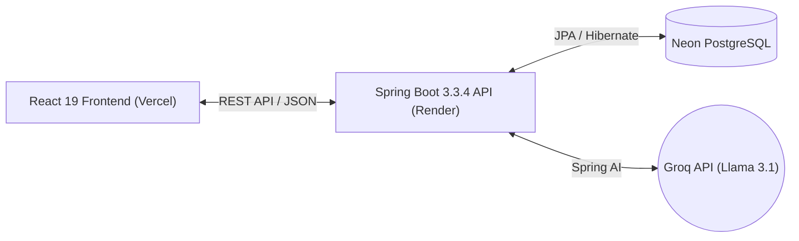

# 🤖 Spark AI: Enterprise AI Chatbot Platform


## 📖 Project Overview
**Spark AI** (TASK-4) is a production-ready, highly polished full-stack web application that delivers a premium ChatGPT-like experience. Built with a stunning dark-mode-first React frontend and a secure Spring Boot 3.3.4 backend, the application connects to the ultra-fast Groq API (Llama 3.1) to generate intelligent responses with minimal latency.

## ✨ Premium Features
- **Enterprise UI/UX:** A stunning, fully responsive dark theme built with Tailwind CSS, Framer Motion, and shadcn/ui. Features glassmorphism, micro-animations, and perfect typography.
- **Robust Security:** Spring Boot API guarded by JWT Authentication, CORS protection, rate limiting, and global exception handling (no stack traces leak).
- **Intelligent AI Integration:** Powered by the Groq API (Llama 3.1 8B Instant) and integrated via Spring AI.
- **Reliable Data Persistence:** Neon Serverless PostgreSQL with Flyway database migrations for robust schema management.
- **Production Ready:** Fully configured for deployment on Render (Backend) and Vercel (Frontend).

## 🏗️ System Architecture



## 🛠️ Technology Stack
| Category | Technology |
|---|---|
| **Frontend** | React 19, Vite, Tailwind CSS, Framer Motion, React Router DOM, TanStack Query |
| **Backend** | Java 21, Spring Boot 3.3.4, Spring Security, Spring AI, Spring Data JPA |
| **Database** | Neon PostgreSQL, Flyway |
| **AI Integration** | Groq API (Llama 3.1 8B Instant) |
| **Security** | JWT Auth, CORS Config, Global Exception Handling |
| **Deployment** | Vercel (Frontend), Render (Backend), Docker |

## 🚀 Local Development Setup

### 1. Backend Configuration
Navigate to the `backend` directory. Configure the following environment variables (or add them to `application.yml` / `application-prod.yml`):
- `DATABASE_URL`: Your Neon PostgreSQL JDBC URL
- `DATABASE_USERNAME` / `DATABASE_PASSWORD`: DB Credentials
- `GROQ_API_KEY`: Your Groq API key
- `JWT_SECRET`: A secure random string for signing tokens
- `FRONTEND_URL`: `http://localhost:5173` (for CORS)

Run the backend:
```bash
cd backend
mvn clean spring-boot:run
```

### 2. Frontend Configuration
Navigate to the `frontend` directory. Create a `.env` file with:
```env
VITE_API_URL=http://localhost:8080
```

Install dependencies and start the dev server:
```bash
cd frontend
npm install
npm run dev
```

## 🌍 Production Deployment Details
- **Backend (Render)**: The backend is containerized/built via Maven and deployed as a Web Service. Health checks are exposed at `/actuator/health` and bypassed by Spring Security.
- **Frontend (Vercel)**: Deployed with Vite build settings. Environment variables are set in the Vercel dashboard.
- **Database (Neon)**: Flyway automatically handles schema generation and migrations on startup.

## 🎓 Learning Outcomes
- Mastered building premium, animation-rich React user interfaces.
- Implemented robust Spring Boot architectures with strict security and exception boundaries.
- Seamlessly integrated third-party AI APIs (Groq) via Spring AI standard interfaces.
- Deployed a complex, multi-service application to the cloud with proper CORS and environment configuration.

---
**Author:** VAJJHA SAI KRISHNA

## Deployment Status
✅ **Spark AI - Production Release Completed** 🚀
