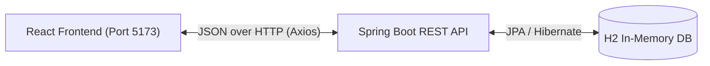

# 🤖 TASK-4: AI Chatbot Application


## 📖 Project Overview
The **AI Chatbot Application** is a complete, production-ready full-stack web application designed to provide a ChatGPT-like experience. It features a beautiful modern frontend, a secure Spring Boot backend, and in-memory database management for seamless conversation tracking.

## ✨ Features
- **Modern UI/UX:** A stunning, responsive interface built with Tailwind CSS and shadcn/ui.
- **Secure Backend:** Spring Boot API with JWT Authentication and Spring Security.
- **Chat History:** Persistent chat history managed via an H2 in-memory database (automatically resets on restart).
- **Clean Architecture:** Strictly adheres to SOLID principles and REST API best practices.
- **Real-Time Interaction:** Smooth, ChatGPT-like conversation flow.

## 🏗️ System Architecture



## 🛠️ Technology Stack
- **Frontend:** React 19, Vite, TypeScript, Tailwind CSS, shadcn/ui, Axios, React Router.
- **Backend:** Java 21, Spring Boot 3.x, Spring Security, JWT, Spring Data JPA.
- **Database:** H2 Database (In-Memory).

## 📂 Folder Structure
```text
TASK-4/
├── backend/            # Spring Boot Server (API & Security)
├── frontend/           # React Client Application (UI/UX)
└── README.md           # This documentation
```

## 🚀 Installation & Running

### 1. Running the Backend
Navigate to the `backend` folder and run the Spring Boot application:
```bash
cd backend
mvn clean spring-boot:run
```
*The backend will start on `http://localhost:8080`. The database is entirely in-memory, so no external DB setup is required!*

### 2. Running the Frontend
Navigate to the `frontend` folder, install dependencies, and start the development server:
```bash
cd frontend
npm install
npm run dev
```
*The frontend will start on `http://localhost:5173`.*

## 🔮 Future Improvements
- Integrate a live LLM API (like OpenAI or Gemini) for real AI responses.
- Transition to a persistent PostgreSQL database for long-term chat history storage.
- Add OAuth2 Social Login (Google, GitHub).

## 🎓 Learning Outcomes
- Mastered advanced React 19 patterns and modern UI components with shadcn/ui.
- Implemented robust stateless JWT authentication in Spring Boot.
- Followed Clean Architecture for highly maintainable and scalable code.

---
**Author:** VAJJHA SAI KRISHNA

## Deployment Status

- ✅ **TASK-4 Updated Successfully** 🚀
